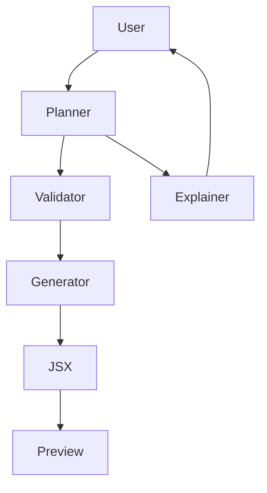

# AI-UI-Generator
AI-UI-Generator is a deterministic AI agent designed to generate safe, schema-validated React UI code from natural language.

Converts natural language UI intent into validated React JSX using a fixed component system. Unlike traditional AI code generators, this system enforces strict schema validation and prevents hallucinated components, props, or styles.

## Preview

Link : https://ai-ui-generator-cyan.vercel.app/
---

## Introduction
AI-UI-Generator implements a structured:
Planner → Validator → Generator → Explaine

Instead of directly generating JSX, the AI first produces a structured JSON layout plan. This plan is validated against strict component schemas before being deterministically rendered into React code.

---

## Features

- Deterministic UI Generation (Schema-bound)
- Planner → Validator → Generator architecture
- Incremental Layout Editing (maintains previous JSON state)
- Automatic Mock Data for Tables and Charts
- Strict Guardrails (no `className`, no `style`, no custom components)
- Live Code + Preview Interface

---

## Requirements

Before installing AI-UI-Generator, ensure your environment meets the following:

- **Node.js** (version 16.x or later)
- **npm** (version 7.x or later) or **yarn**
- **Modern Web Browser** (for UI preview)
- **OpenAI API Key**
- **Git** (for cloning the repository)

---

## Installation

Follow these steps to set up AI-UI-Generator locally:

1. **Clone the Repository**
   ```bash
   git clone https://github.com/KalaHarshal/AI-UI-Generator.git
   cd AI-UI-Generator
   ```

2. **Install Dependencies**
   Using npm:
   ```bash
   npm install
   ```
   Or with yarn:
   ```bash
   yarn install
   ```

3. **Configure Environment Variables**
   Create a `.env.local` file in the project root:
   ```env
   OPENAI_API_KEY=your_openai_api_key
   ```

4. **Start the Development Server**
   ```bash
   npm run dev
   ```
   The application will be available at `http://localhost:3000`.

---

## Usage

1. Enter a natural language prompt.  
   Example:  
   "Create a dashboard with a sidebar and three stat cards."

2. The system:  
   - Generates a structured JSON layout plan  
   - Validates it against component schemas  
   - Deterministically renders JSX  
   - Displays live preview

3. Modify incrementally:  
   Example:  
   "Add a chart below the stats."

---

## Environment Variables

Required environment configuration is minimal and straightforward.

- `OPENAI_API_KEY=your_key_here`

---

## System Architecture Overview

Below is a flowchart illustrating the high-level architecture:



---

## Deterministic Guarantees

- The AI cannot invent components.
- The AI cannot invent props.
- The AI cannot generate className or style attributes.
- All output passes strict schema validation.
- JSX rendering is handled by a pure function (non-LLM).

---

## Design Philosophy

This system prioritizes:

- Determinism over creativity
- Safety over styling flexibility
- Structural correctness over visual freedom
- Schema validation over raw code generation

---

## License

This project is licensed under the MIT License. You are free to use, modify, and distribute the code for personal or commercial projects, provided you include the original license and copyright notice.

---

## Contributing

We welcome contributions to AI-UI-Generator! To get started:

- Fork the repository and create a new branch for your feature or fix.
- Ensure code adheres to the existing style and passes all linter/prettier checks.
- Write or update tests as necessary.
- Submit a pull request with a clear description of your changes.

### Contribution Guidelines

- Open issues for feature requests or bugs before starting large work.
- Write clear commit messages and PR descriptions.
- Respect the code review process—address feedback promptly.
- Help us keep documentation up-to-date.
